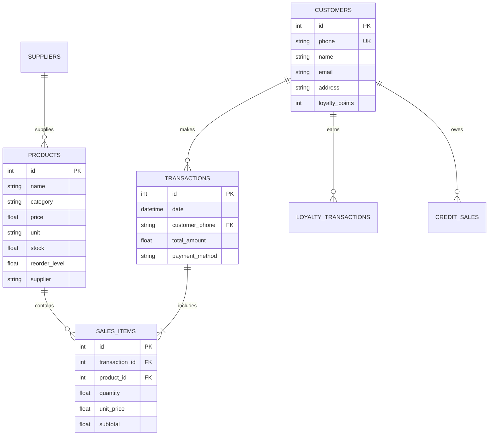

# BuildSmartOS Developer Guide

**Version 1.0 | Technical Documentation**

---

## Table of Contents

1. [Architecture Overview](#architecture-overview)
2. [Project Structure](#project-structure)
3. [Core Modules](#core-modules)
4. [Database Schema](#database-schema)
5. [API Reference](#api-reference)
6. [Extension Guide](#extension-guide)
7. [Testing](#testing)
8. [Development Workflow](#development-workflow)

---

## Architecture Overview

### System Architecture

BuildSmartOS follows a **modular monolithic architecture** with the following layers:

```
┌─────────────────────────────────────────┐
│         Presentation Layer (UI)         │
│        CustomTkinter Components         │
├─────────────────────────────────────────┤
│         Business Logic Layer            │
│   Product │ Customer │ Sales │ Reports  │
├─────────────────────────────────────────┤
│          Data Access Layer              │
│         SQLite Database (CRUD)          │
├─────────────────────────────────────────┤
│         Integration Layer               │
│  PDF │ WhatsApp │ Voice │ Analytics     │
└─────────────────────────────────────────┘
```

### Technology Stack

| Layer | Technology | Purpose |
|-------|------------|---------|
| **UI Framework** | CustomTkinter | Modern, customizable tkinter |
| **Database** | SQLite3 | Embedded relational database |
| **PDF Generation** | ReportLab | Professional invoice PDFs |
| **Analytics** | Matplotlib, Pandas, NumPy | Data visualization & analysis |
| **WhatsApp** | PyWhatKit | Message automation |
| **Barcode** | OpenCV, pyzbar | QR/barcode scanning |
| **Voice** | SpeechRecognition, pyttsx3 | Voice commands |
| **AI** | scikit-learn | Predictive analytics |

### Design Patterns

1. **Singleton Pattern:** Database connection manager
2. **Factory Pattern:** UI component creation
3. **Observer Pattern:** Cart updates and UI refresh
4. **Strategy Pattern:** Report generation
5. **MVC Pattern:** Separation of concerns (loosely implemented)

---

## Project Structure

```
BuildSmartOS/
│
├── main.py                      # Main application entry point
├── database_setup.py            # Database initialization & schema
├── database_validator.py        # Database integrity checker
├── check_database.py            # Quick database status check
│
├── Core Modules
├── product_manager.py           # Product CRUD operations
├── customer_manager.py          # Customer management
├── report_generator.py          # 10 report types
├── analytics_dashboard.py       # Sales analytics & charts
│
├── Feature Modules
├── pdf_generator.py             # Invoice PDF generation
├── whatsapp_service.py          # WhatsApp integration
├── barcode_scanner.py           # Barcode/QR scanning
├── voice_assistant.py           # Voice command interface
├── loyalty_manager.py           # Loyalty points system
├── construction_estimator.py    # Construction cost calculator
├── ai_predictor.py              # AI sales predictions
│
├── UI & Utilities
├── ui_components.py             # Reusable UI widgets
├── themes.py                    # Color schemes & styles
├── language_manager.py          # Multi-language support
├── error_handler.py             # Error logging & handling
│
├── Configuration & Data
├── config.json                  # Application configuration
├── requirements.txt             # Python dependencies
├── buildsmart_hardware.db       # SQLite database
│
├── Directories
├── bills/                       # Generated PDF invoices
├── reports/                     # Exported reports
├── backups/                     # Database backups
├── translations/                # Language JSON files
│   ├── english.json
│   ├── sinhala.json
│   └── tamil.json
│
└── Testing & Docs
    ├── test_core_functionality.py
    ├── test_product_manager.py
    ├── test_customer_manager.py
    ├── test_analytics.py
    ├── generate_test_data.py
    ├── USER_MANUAL.md
    ├── DEVELOPER_GUIDE.md
    ├── TROUBLESHOOTING.md
    ├── PHASE1_COMPLETE.md
    └── PHASE2_TEST_REPORT.md
```

---

## Core Modules

### 1. main.py

**Entry Point:** Main application class and UI orchestration

#### BuildSmartPOS Class

Primary application class inheriting from `customtkinter.CTk`.

**Key Attributes:**
```python
self.db_connection       # SQLite connection
self.cart                # Dictionary {product_id: {name, price, qty, max_stock}}
self.current_language    # Selected language ('english', 'sinhala', 'tamil')
self.customer_phone      # Current customer phone (if added)
self.whatsapp_enabled    # Boolean for WhatsApp checkbox
```

**Key Methods:**

| Method | Description |
|--------|-------------|
| `__init__()` | Initialize window, load config, create UI |
| `create_top_bar()` | Navigation buttons and language selector |
| `create_product_list_frame()` | Left panel with scrollable products |
| `create_cart_frame()` | Right panel with cart and checkout |
| `load_products(search_term)` | Fetch and display products from DB |
| `add_to_cart(p_id, name, price, max_stock)` | Add item to cart |
| `update_cart_ui()` | Refresh cart display |
| `checkout_action()` | Process transaction and record sale |

**UI Layout:**
```
┌──────────────────────────────────────────────────┐
│  Top Bar: Products │ Customers │ Reports │ etc.  │
├───────────────────────┬──────────────────────────┤
│   Product List        │   Shopping Cart          │
│   (Scrollable)        │   (Items + Totals)       │
│   ┌─────────────┐     │   [ ] Send WhatsApp      │
│   │  Product 1  │     │   [Add Customer]         │
│   │  LKR 500    │     │   [CHECKOUT]             │
│   └─────────────┘     │                          │
└───────────────────────┴──────────────────────────┘
```

### 2. database_setup.py

**Purpose:** Database schema creation and validation

#### Database Schema

**8 Tables:**

1. **products** - Product inventory
2. **customers** - Customer database
3. **transactions** - Sales records
4. **sales_items** - Transaction line items
5. **suppliers** - Supplier information
6. **loyalty_transactions** - Points history
7. **credit_sales** - Credit tracking
8. **expenses** - Business expenses

#### Key Functions

```python
create_connection()
# Returns: sqlite3.Connection object
# Purpose: Establish database connection

create_tables()
# Returns: None
# Purpose: Create all 8 tables with indexes and triggers

backup_database(backup_name=None)
# Args: backup_name (str) - Optional custom name
# Returns: None
# Purpose: Create timestamped backup in backups/ folder

validate_database()
# Returns: None
# Purpose: Check schema integrity and data consistency

add_dummy_data()
# Returns: None
# Purpose: Add sample products for testing
```

### 3. product_manager.py

**Purpose:** Product CRUD operations and UI

#### show_product_manager(parent)

Opens product management window with:
- Product list (searchable)
- Add/Edit/Delete operations
- CSV import/export
- Stock level monitoring

**Key Operations:**

```python
# Add Product
cursor.execute("""
    INSERT INTO products (name, category, price, unit, stock, reorder_level, supplier)
    VALUES (?, ?, ?, ?, ?, ?, ?)
""", (name, category, price, unit, stock, reorder_level, supplier))

# Update Product
cursor.execute("""
    UPDATE products 
    SET name=?, category=?, price=?, unit=?, stock=?, reorder_level=?, supplier=?
    WHERE id=?
""", (name, category, price, unit, stock, reorder_level, supplier, product_id))

# Delete Product
cursor.execute("DELETE FROM products WHERE id=?", (product_id,))

# Search Products
cursor.execute("""
    SELECT * FROM products 
    WHERE name LIKE ? OR category LIKE ?
    ORDER BY name
""", (f"%{search}%", f"%{search}%"))
```

### 4. customer_manager.py

**Purpose:** Customer relationship management

#### Features

- Customer registration
- Purchase history tracking
- Loyalty points management
- Customer search
- Detailed customer profiles

#### Key Operations

```python
# Register Customer
cursor.execute("""
    INSERT INTO customers (phone, name, email, address, loyalty_points)
    VALUES (?, ?, ?, ?, 0)
""", (phone, name, email, address))

# Get Customer Purchase History
cursor.execute("""
    SELECT t.id, t.date, t.total_amount
    FROM transactions t
    WHERE t.customer_phone = ?
    ORDER BY t.date DESC
""", (phone,))

# Update Loyalty Points
points = int(total_amount / 100)  # 1 point per LKR 100
cursor.execute("""
    UPDATE customers 
    SET loyalty_points = loyalty_points + ?
    WHERE phone = ?
""", (points, phone))
```

### 5. report_generator.py

**Purpose:** 10 comprehensive business reports

#### Report Types

1. Daily Sales Report
2. Monthly Sales Report
3. Top Products Report
4. Low Stock Report
5. Customer Purchase History
6. Profit Analysis
7. Category Performance
8. Supplier Report
9. Expense Report
10. Complete Inventory Report

#### show_reports(parent)

```python
def show_reports(parent):
    # Create report window
    # Dropdown to select report type
    # Date range selectors
    # Generate button
    # Export options (TXT, CSV)
```

**Export Formats:**
- **TXT:** Human-readable format
- **CSV:** Excel-compatible spreadsheet

---

## Database Schema

### Entity Relationship Diagram



### Table Schemas

#### products

```sql
CREATE TABLE products (
    id INTEGER PRIMARY KEY AUTOINCREMENT,
    name TEXT NOT NULL,
    category TEXT,
    price REAL DEFAULT 0.0,
    unit TEXT DEFAULT 'piece',
    stock REAL DEFAULT 0.0,
    reorder_level REAL DEFAULT 10.0,
    supplier TEXT,
    created_at TIMESTAMP DEFAULT CURRENT_TIMESTAMP
);
```

**Indexes:**
- `idx_products_category` ON category
- `idx_products_stock` ON stock
- `idx_products_name` ON name

#### customers

```sql
CREATE TABLE customers (
    id INTEGER PRIMARY KEY AUTOINCREMENT,
    phone TEXT UNIQUE NOT NULL,
    name TEXT,
    email TEXT,
    address TEXT,
    loyalty_points INTEGER DEFAULT 0,
    created_at TIMESTAMP DEFAULT CURRENT_TIMESTAMP
);
```

**Indexes:**
- `idx_customers_phone` ON phone (UNIQUE)

#### transactions

```sql
CREATE TABLE transactions (
    id INTEGER PRIMARY KEY AUTOINCREMENT,
    date TIMESTAMP DEFAULT CURRENT_TIMESTAMP,
    customer_phone TEXT,
    total_amount REAL DEFAULT 0.0,
    payment_method TEXT DEFAULT 'Cash',
    FOREIGN KEY (customer_phone) REFERENCES customers(phone)
);
```

**Indexes:**
- `idx_transactions_date` ON date
- `idx_transactions_customer` ON customer_phone

#### sales_items

```sql
CREATE TABLE sales_items (
    id INTEGER PRIMARY KEY AUTOINCREMENT,
    transaction_id INTEGER NOT NULL,
    product_id INTEGER NOT NULL,
    quantity REAL NOT NULL,
    unit_price REAL NOT NULL,
    subtotal REAL NOT NULL,
    FOREIGN KEY (transaction_id) REFERENCES transactions(id),
    FOREIGN KEY (product_id) REFERENCES products(id)
);
```

**Indexes:**
- `idx_sales_items_transaction` ON transaction_id
- `idx_sales_items_product` ON product_id

### Database Triggers

#### 1. Stock Update Trigger

Automatically reduces stock when sale is made:

```sql
CREATE TRIGGER update_stock_on_sale
AFTER INSERT ON sales_items
BEGIN
    UPDATE products 
    SET stock = stock - NEW.quantity
    WHERE id = NEW.product_id;
END;
```

#### 2. Loyalty Points Trigger

Automatically adds loyalty points to customer:

```sql
CREATE TRIGGER add_loyalty_points
AFTER INSERT ON transactions
WHEN NEW.customer_phone IS NOT NULL
BEGIN
    UPDATE customers 
    SET loyalty_points = loyalty_points + CAST(NEW.total_amount / 100 AS INTEGER)
    WHERE phone = NEW.customer_phone;
END;
```

---

## API Reference

### Database Functions

#### Connection Management

```python
def create_connection() -> sqlite3.Connection:
    """
    Establish database connection.
    
    Returns:
        sqlite3.Connection: Database connection object
        
    Raises:
        sqlite3.Error: If connection fails
    """
```

#### Product Operations

```python
def get_products(search_term: str = "") -> List[Tuple]:
    """
    Retrieve products from database.
    
    Args:
        search_term: Optional search filter
        
    Returns:
        List of tuples: (id, name, category, price, unit, stock)
    """

def add_product(name: str, category: str, price: float, 
                unit: str, stock: float, reorder_level: float,
                supplier: str = "") -> int:
    """
    Add new product to database.
    
    Args:
        name: Product name
        category: Product category
        price: Unit price
        unit: Measurement unit
        stock: Initial stock quantity
        reorder_level: Low stock threshold
        supplier: Supplier name (optional)
        
    Returns:
        int: New product ID
    """
```

#### Transaction Operations

```python
def create_transaction(customer_phone: str, total_amount: float,
                       cart: Dict, payment_method: str = "Cash") -> int:
    """
    Create new transaction and sales items.
    
    Args:
        customer_phone: Customer phone (or None)
        total_amount: Total sale amount
        cart: Dictionary of cart items
        payment_method: Payment type
        
    Returns:
        int: New transaction ID
        
    Side Effects:
        - Creates transaction record
        - Creates sales_items records
        - Updates product stock
        - Updates customer loyalty points (if applicable)
    """
```

### PDF Generation

```python
def generate_invoice(transaction_id: int, items: List[Dict],
                     total: float, customer_phone: str = None) -> str:
    """
    Generate PDF invoice.
    
    Args:
        transaction_id: Transaction ID for invoice number
        items: List of cart items
        total: Total amount
        customer_phone: Customer phone (optional)
        
    Returns:
        str: Path to generated PDF file
        
    File Location: bills/invoice_{transaction_id}_{timestamp}.pdf
    """
```

### Analytics Functions

```python
def get_sales_summary(start_date: str, end_date: str) -> Dict:
    """
    Get sales summary for date range.
    
    Args:
        start_date: Start date (YYYY-MM-DD)
        end_date: End date (YYYY-MM-DD)
        
    Returns:
        Dict with keys:
            - total_revenue: float
            - num_transactions: int
            - avg_transaction: float
            - top_products: List[Tuple]
    """
```

---

## Extension Guide

### Adding a New Report Type

**Step 1:** Update `report_generator.py`

```python
def generate_new_report(conn, params):
    """Generate new custom report"""
    cursor = conn.cursor()
    
    # Your SQL query
    cursor.execute("""
        SELECT ...
        FROM ...
        WHERE ...
    """, params)
    
    results = cursor.fetchall()
    
    # Format report
    report = "New Report\n"
    report += "=" * 50 + "\n"
    
    for row in results:
        report += f"{row[0]}: {row[1]}\n"
    
    return report
```

**Step 2:** Add to report menu

```python
report_types = [
    "Daily Sales",
    # ... existing types
    "Your New Report"  # Add here
]
```

**Step 3:** Handle in generate button

```python
def generate_report():
    selected = report_type_var.get()
    
    if selected == "Your New Report":
        report_text = generate_new_report(conn, params)
```

### Adding a New Language

**Step 1:** Create translation file

Create `translations/language_name.json`:

```json
{
  "app_title": "Translated Title",
  "search_products": "Translated Search",
  "checkout": "Translated Checkout",
  "add_customer": "Translated Add Customer",
  ...
}
```

**Step 2:** Update language_manager.py

```python
AVAILABLE_LANGUAGES = {
    'english': 'translations/english.json',
    'sinhala': 'translations/sinhala.json',
    'tamil': 'translations/tamil.json',
    'your_language': 'translations/your_language.json'  # Add here
}
```

**Step 3:** Add to language dropdown

```python
language_menu = ctk.CTkOptionMenu(
    master=top_bar,
    values=["English", "සිංහල", "தமிழ்", "YourLanguage"],  # Add here
    command=lambda lang: self.change_language(lang.lower())
)
```

### Adding a New Feature Module

**Step 1:** Create module file

```python
# feature_module.py

import customtkinter as ctk
from tkinter import messagebox

def show_feature_window(parent):
    """
    Display feature window.
    
    Args:
        parent: Parent BuildSmartPOS instance
    """
    window = ctk.CTkToplevel(parent)
    window.title("Feature Name")
    window.geometry("800x600")
    
    # Your UI code here
    
    def perform_action():
        # Your business logic
        pass
    
    # Buttons
    action_btn = ctk.CTkButton(
        window,
        text="Perform Action",
        command=perform_action
    )
    action_btn.pack(pady=20)
    
    return window
```

**Step 2:** Import in main.py

```python
try:
    from feature_module import show_feature_window
    FEATURE_AVAILABLE = True
except ImportError:
    FEATURE_AVAILABLE = False
    print("Feature not available")
```

**Step 3:** Add button in top bar

```python
if FEATURE_AVAILABLE:
    feature_btn = ctk.CTkButton(
        top_bar,
        text="🔧 Feature",
        command=self.show_feature
    )
    feature_btn.pack(side="left", padx=5)
```

**Step 4:** Add method to BuildSmartPOS

```python
def show_feature(self):
    """Show feature window"""
    if FEATURE_AVAILABLE:
        show_feature_window(self)
```

---

## Testing

### Test Infrastructure

BuildSmartOS uses Python's `unittest` framework.

#### Running Tests

```bash
# Run all tests
python -m unittest discover

# Run specific test file
python test_core_functionality.py
python test_product_manager.py
python test_customer_manager.py
python test_analytics.py
```

### Test Coverage

**Phase 2 Test Results:** 27/27 tests passed (100%)

| Module | Tests | Coverage |
|--------|-------|----------|
| Core Functionality | 10/10 | Database, CRUD, Transactions |
| Product Manager | 5/5 | Add, Update, Search, Categories |
| Customer Manager | 5/5 | Registration, Loyalty, History |
| Analytics | 7/7 | Sales Summary, Top Products, Trends |

### Writing Tests

```python
import unittest
import sqlite3
from database_setup import create_connection

class TestNewFeature(unittest.TestCase):
    
    @classmethod
    def setUpClass(cls):
        """Run once before all tests"""
        cls.conn = create_connection()
    
    def setUp(self):
        """Run before each test"""
        self.cursor = self.conn.cursor()
    
    def test_feature_operation(self):
        """Test feature functionality"""
        # Arrange
        test_data = {"key": "value"}
        
        # Act
        result = perform_operation(test_data)
        
        # Assert
        self.assertIsNotNone(result)
        self.assertEqual(result["status"], "success")
    
    def tearDown(self):
        """Run after each test"""
        self.conn.rollback()  # Undo changes
    
    @classmethod
    def tearDownClass(cls):
        """Run once after all tests"""
        cls.conn.close()

if __name__ == "__main__":
    unittest.main()
```

---

## Development Workflow

### Setting Up Development Environment

1. **Clone/Download Project**
2. **Create Virtual Environment** (Optional but recommended)
   ```bash
   python -m venv venv
   venv\Scripts\activate  # Windows
   ```
3. **Install Dependencies**
   ```bash
   pip install -r requirements.txt
   ```
4. **Initialize Database**
   ```bash
   python database_setup.py
   ```
5. **Run Application**
   ```bash
   python main.py
   ```

### Code Style Guidelines

- **PEP 8:** Follow Python style guide
- **Docstrings:** Use for all functions and classes
- **Comments:** Explain complex logic
- **Naming:**
  - Functions: `snake_case`
  - Classes: `PascalCase`
  - Constants: `UPPER_SNAKE_CASE`

### Git Workflow

```bash
# Feature development
git checkout -b feature/feature-name
# Make changes
git add .
git commit -m "Add: feature description"
git push origin feature/feature-name

# Bug fixes
git checkout -b fix/bug-description
# Fix the bug
git commit -m "Fix: bug description"
```

### Debugging

**Enable Debug Mode:**

```python
# In main.py
DEBUG = True

if DEBUG:
    print(f"Cart contents: {self.cart}")
    print(f"Transaction ID: {transaction_id}")
```

**Database Inspection:**

```bash
# Open SQLite shell
sqlite3 buildsmart_hardware.db

# Run queries
.tables
SELECT * FROM products LIMIT 5;
.quit
```

### Performance Optimization

1. **Database Indexes:** Already optimized (16 indexes)
2. **Lazy Loading:** Load products on demand
3. **Connection Pooling:** Reuse database connections
4. **UI Throttling:** Limit real-time search updates

---

## Deployment

### Creating Executable

Using PyInstaller:

```bash
pip install pyinstaller

pyinstaller --name="BuildSmartOS" \
            --windowed \
            --onefile \
            --add-data "translations;translations" \
            --add-data "config.json;." \
            --icon=icon.ico \
            main.py
```

### Distribution Package

Include:
1. Executable or Python scripts
2. `buildsmart_hardware.db` (empty or with sample data)
3. `config.json`
4. `translations/` folder
5. `README.md`
6. `USER_MANUAL.md`

---

**BuildSmartOS Developer Guide v1.0**  
*Last Updated: December 15, 2025*  
*Technical Documentation for Developers*
